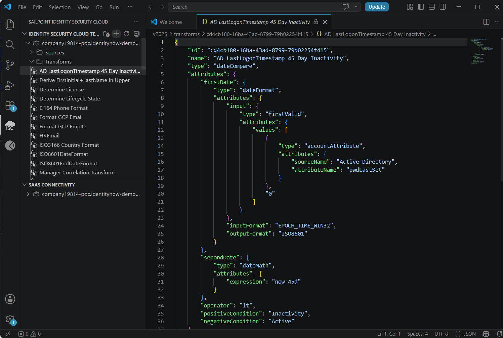
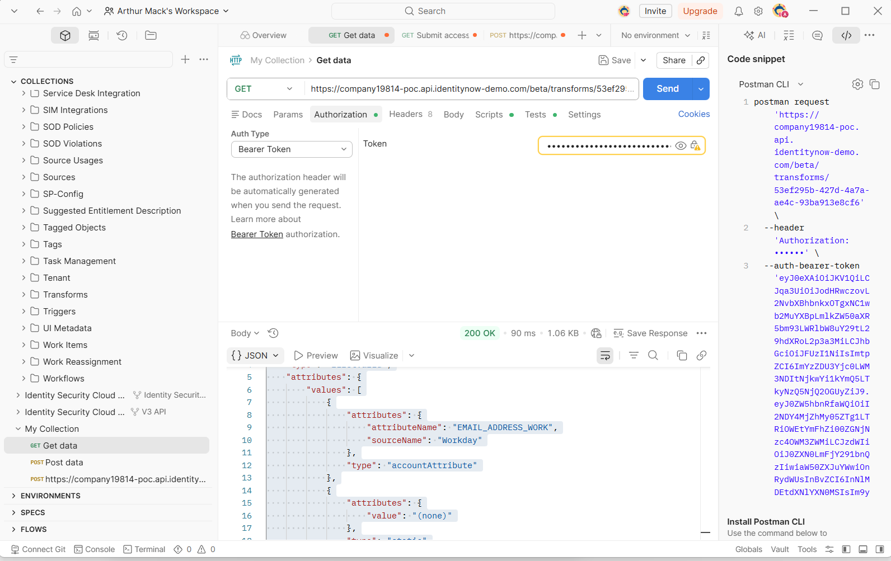
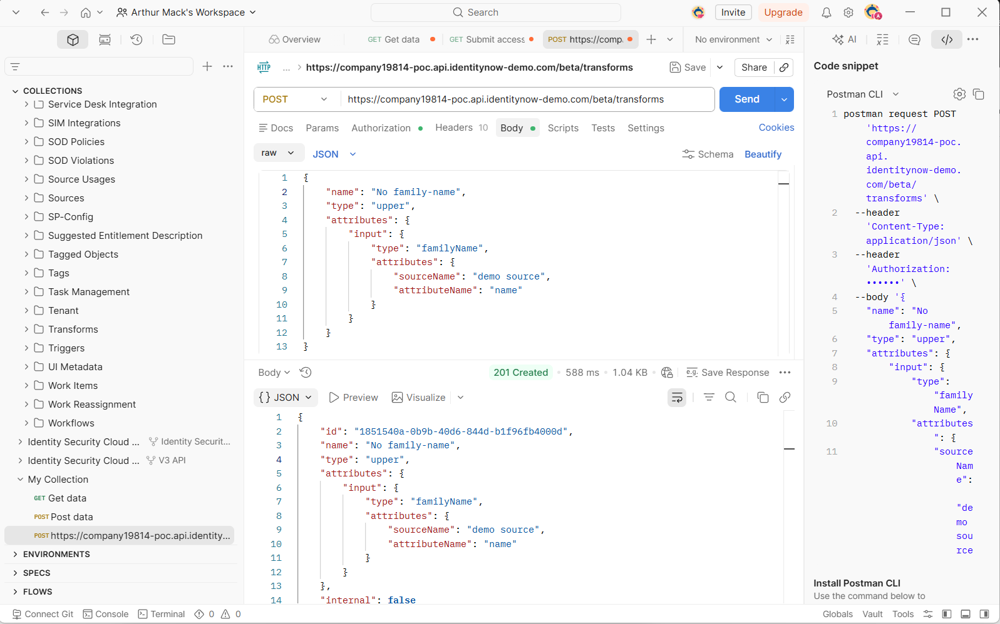

# 🧬 Identity Attribute Transforms & API Automation Engine

This section demonstrates technical competency in engineering declarative attribute transforms, programmatic data normalization pipelines, and REST API automation workflows across hybrid SailPoint deployment architectures using **VS Code** and **Postman** [07-Identity-Transforms-API-Automation].

---

## 🏗️ Technical Architecture & Ecosystem Mapping

Enterprise Identity Governance and Administration (IGA) relies on clear mapping protocols to bridge the gap between human HR records and downstream system targets.

### Business Logic Mapping Across Deployments
* **Joiner Flow (Establish Identity):** Triggers user account data onboarding from an authoritative source.
* **Schema & Correlation Handshake:** Automatically stitches target application accounts (e.g., Active Directory) to a central human identity profile, preventing orphan accounts [03-Application-Onboarding].
* **Data Aggregation Engine:** Queries endpoint targets to pull entitlement structures into the governance ledger for lifecycle management and access certification [03-Application-Onboarding].

---

## 🛠️ Project Implementation Case Study 1: Department Text Normalization

### Objective
Standardize incoming unstructured user account data profiles from an upstream HR system source payload. The deployment target application requires capitalization standardization (converting string targets from `FINANCE AND OPERATIONS` to `Finance And Operations`).

### Implementation A: IdentityIQ (Legacy On-Prem / Java-BeanShell)
Deployed inside an XML application data model target structure using native `sailpoint.object` classes [01-IIQ-Rules-BeanShell]. This script executes a loop modification pattern over raw text arrays during aggregation runtime [01-IIQ-Rules-BeanShell]. Developed locally via VS Code before deployment.

```xml
<?xml version='1.0' encoding='UTF-8'?>
<!DOCTYPE Rule PUBLIC "sailpoint.dtd" "sailpoint.dtd">
<Rule name="Format Department Rule" type="ResourceObjectCustomization">
<Description>Standardizes department attribute formatting inside IdentityIQ.</Description>
<Source>
<![CDATA[
  String hrDept = object.getAttribute("department");
  if (hrDept != null) {
      hrDept = hrDept.toLowerCase();
      String[] words = hrDept.split(" ");
      StringBuilder formattedDept = new StringBuilder();
      for (String word : words) {
          if (word.length() > 0) {
              formattedDept.append(Character.toUpperCase(word.charAt(0))).append(word.substring(1)).append(" ");
          }
      }
      object.put("department", formattedDept.toString().trim());
  }
]]>
</Source>
</Rule>
```

### Implementation B: Identity Security Cloud (Modern Cloud / JSON API)
Deployed declaratively via the SailPoint Identity Security Cloud REST engine using **Postman** orchestration pipelines and **VS Code** [07-Identity-Transforms-API-Automation]. Avoids procedural scripting runtime loops in favor of a declarative functional mapping syntax block.

* **API Configuration Pipeline Target:** `POST https://{tenant}://`
* **Integration Payload:**
```json
{
  "name": "Format Department Name",
  "type": "title",
  "attributes": {
    "input": {
      "type": "accountAttribute",
      "attributes": {
        "sourceName": "HR Application Source",
        "attributeName": "department"
      }
    }
  }
}
```

---

## 🛠️ Project Implementation Case Study 2: AD Account Inactivity Calculations

### Objective
Enforce automated least-privilege boundary rules over target systems by evaluating an Active Directory user account's last login timestamp (`pwdLastSet`) to automatically identify and flag profiles that have been inactive for more than 45 days.

### Implementation Blueprint (Developed in VS Code)
This cloud-native transform parses a Win32 Epoch time string from the source application schema and compares it mathematically to a dynamic asset timestamp window (`now-45d`).

```json
{
  "name": "AD LastLogonTimestamp 45 Day Inactivity",
  "type": "dateCompare",
  "attributes": {
    "firstDate": {
      "type": "dateFormat",
      "attributes": {
        "input": {
          "type": "firstValid",
          "attributes": {
            "values": [
              {
                "type": "accountAttribute",
                "attributes": {
                  "sourceName": "Active Directory",
                  "attributeName": "pwdLastSet"
                }
              },
              "0"
            ]
          }
        },
        "inputFormat": "EPOCH_TIME_WIN32",
        "outputFormat": "ISO8601"
      }
    },
    "secondDate": {
      "type": "dateMath",
      "attributes": {
        "expression": "now-45d"
      }
    },
    "operator": "lt",
    "positiveCondition": "Inactivity",
    "negativeCondition": "Active"
  }
}
```

#### 🖼️ Live VS Code Workspace Verification
Documents the structural schema formatting of the `dateCompare` mapping block within the native IDE text panel before platform deployment:


---

## 🚀 API Automation & Programmatic Validation (Postman Pipeline)

### 1. OAuth 2.0 Bearer Token Authentication
To gain administrative write access to the backend platform database, Postman is used to negotiate a trusted authorization state, extracting an encrypted runtime token from the identity platform's gateway.

#### 🖼️ Postman Authorization Handshake Verification


### 2. Programmatic Database Deployment (HTTP POST Request)
Once authorized, an HTTP `POST` request is executed against the `/beta/transforms` gateway. The **201 Created** success response confirms that the live backend configuration tables have accepted and activated the logic.

#### 🖼️ Postman HTTP 201 Created Response Verification


---

## 📈 Core Technical Competencies Highlighted
* **Development Framework Mapping:** Proficient with data structuring syntax models including JSON schema manipulation, Apache Velocity templates, and legacy Java BeanShell context scripting wrappers [01-IIQ-Rules-BeanShell, 07-Identity-Transforms-API-Automation].
* **API Automation Orchestration:** Experienced utilizing Postman testing environments to pull cloud platform authentication tokens, query endpoints, and deploy core configuration transformations [07-Identity-Transforms-API-Automation].
* **Troubleshooting Architecture:** Capable of diagnosing platform authentication faults, adjusting broken correlation rules, parsing raw API response payloads, and rectifying system account anomalies [03-Application-Onboarding].
